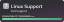

<dl>
  
  
</dl>
   

**mdpkm is yet another instance manager for Minecraft.** 
incomplete description

## Features
| Feature           | Status                    |
|-------------------|---------------------------|
| Modloader Support | ✅                        |
| Bedrock Edition   | 🚧                        |
| Mod Installation  | ✅ (Modrinth)             |
| Mod Management    | ✅                        |
| Modpacks          | 🚧 Being Revamped         |
| Exporting         | ✅ (Custom Format)        |

## Loader/Minecraft Support
| Loader Name       | Status             |
|-------------------|--------------------|
| Java Edition      | ✅ (All Versions)  |
| Bedrock Edition   | 🚧                 |
| Fabric Loader     | ✅                 |
| Forge Mod Loader  | ✅                 |
| Quilt Loader      | ✅ (Beta Software) |

## Translation
| Language | Translators                                | Status  |
|----------|--------------------------------------------|---------|
| English  |                                            | ✅      |
| Latvian  | [JanisNied](https://twitter.com/JanisNied) | Pending |
| Russian  | [JanisNied](https://twitter.com/JanisNied) | Pending |

 

##  Installation
All installer files can be found through the [releases](https://github.com/Blookerss/mdpkm/releases) page. 
Download the latest release [here](https://github.com/Blookerss/mdpkm/releases/latest).
  

      

      

      

## 🤔 Usage
not yet
 

## 🥰 Contributing
pull requests.
 

## 🔗 Links

there arent any

## 🧩 Building Blocks
<dl>
  
  
  
</dl>
<dl>
  
  
  
</dl>
incomplete
 
